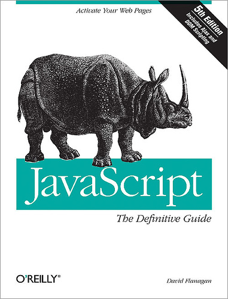
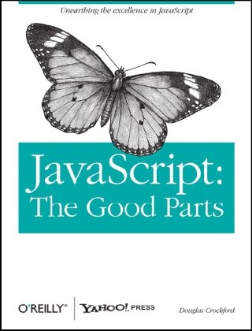

!SLIDE center 

# "The World's Most Misunderstood Programming Language" #

Douglas Crockford _(Yahoo! JavaScript Architect)_

!SLIDE bullets incremental transition=scrollUp

# Razones #

* El nombre lenguaje
* Errores de diseño
* Malas implementaciones / Los navegadores
* Literatura sobre el lenguaje
* El estándar (ECMA)
* Es un lenguaje funcional

!SLIDE center transition=scrollUp

!SLIDE center transition=scrollUp

!SLIDE center transition=scrollUp

!SLIDE bullets incremental transition=scrollUp

# Ideas Clave #

* Distribución "Load and Go"
* "Loose typing"
* Objetos como contenedores
* Herencia basada en prototipos
* Funciones anónimas
* Variables globales

!SLIDE bullets incremental transition=scrollUp

# Valores #

* Number
* String
* Boolean
* Object
* null
* undefined

!SLIDE bullets incremental transition=scrollUp

# Números #

* Solo existe un tipo de número
* IEEE-754 (aka “Double”)
* 0.1 + 0.2 = 0.30000000000000004

!SLIDE bullets incremental transition=scrollUp

# NaN #

* Un número especial: Not a Number
* Resultado inesperado o una operación errónea
* NaN no es igual a nada (incluyendo NaN)

!SLIDE bullets incremental transition=scrollUp

# Función Number() #

##  Number() ##

* Convierte un valor a número
* Produce NaN en caso de problemas
* Es equivalente a +

!SLIDE bullets incremental transition=scrollUp

# Función parseInt() #

* Convierte un valor a un número
* Se detiene en el primer caracter no numérico
* El segundo parámetro es __importante__

!SLIDE execute transition=scrollUp

# parseInt() #

    @@@ javaScript
	  result = parseInt("08");

!SLIDE execute transition=scrollUp

# parseInt() #

    @@@ javaScript
	  result = parseInt("08", 10);

!SLIDE execute transition=scrollUp

# Math #

    @@@ javaScript
    abs     // valor absoluto
    floor   // la parte entera de un número
    log     // logaritmo
    max     // max
    pow     // exponencial
    random	// random
    round   // el entero más próximo
    sin     // seno
    sqrt    // raiz cuadrada

!SLIDE execute transition=scrollUp

# Math #

    @@@ javaScript
    result = Math.floor(125.26);

!SLIDE bullets incremental transition=scrollUp

# Strings #

* Secuencia de 0 o más caracteres
* No existe un tipo __Char__
* Las cadenas son inmutables
* Comillas dobles o sencillas

!SLIDE execute transition=scrollUp

# Strings #

    @@@ javaScript
    result = 'Openbravo' == "Openbravo";

!SLIDE execute transition=scrollUp

# String.length #

    @@@ javaScript
    result = "Openbravo".length;

!SLIDE execute transition=scrollUp

# Función String() #

    @@@ javaScript
    result = typeof String(123);

!SLIDE transition=scrollUp

# Métodos String #

    @@@ javaScript
    charAt
    concat
    indexOf
    lastIndexOf
    match
    replace
    search
    slice
    split
    substring
    toLowerCase
    toUpperCase

!SLIDE transition=scrollUp

# Booleans #

    @@@ javaScript
    true
    false

!SLIDE bullets transition=scrollUp

# Función Boolean() #

    @@@ javaScript
    new Boolean();

* Devuelve __true__ si la expresión es _verdadera_
* Devuelve __false__ si la expresión es _falsa_

!SLIDE bullets

# null #

* Un valor que no es nada

!SLIDE bullets incremental transition=scrollUp

# undefined #

* Un valor que no es ni siquiera __null__
* Un valor por defecto para variables y parámetros
* El valor para miembros no existentes de un Objeto

!SLIDE

# Expresiones falsas #

    @@@ javaScript
    false
    null
    undefined
    "" 	(cadena vacía)
    0
    NaN

!SLIDE execute transition=scrollUp

# Todo el resto de expresiones incluyendo objetos son verdaderas #

    @@@ javaScript
    result = "false" == false;

!SLIDE bullets incremental transition=scrollUp

# Objetos dinámicos #

* Un tabla _Hash_ (clave/valor)
* __new Object__ produce un contenedor vacío
* La forma abreviada: {}
* El nombre de la clave puede ser cualquier valor excepto _undefined_

!SLIDE

## Notación para acceder a los miembros ##

    @@@ javaScript
    MiObjeto.clave
    MiObjeto['clave']

!SLIDE bullets

* __Funciones__ pueden ser asignadas como valores de un Objeto

!SLIDE center bullets

# Identificadores #

Nombre de variables, funciones, miembro de un objeto

* Empiezan con una letra, $ o _
* Por convención empiezan con un letra minúscula

!SLIDE

# Palabras reservadas #

    abstract boolean break byte case catch char
    class const continue debugger default
    delete do double  else enum export
    extends false final finally float
    for function goto if implements
    import in instanceof int interface
    long native new null package
    private protected public
    return short static super
    switch synchronized this throw
    throws transient true try typeof var
    volatile void while with

!SLIDE

# En uso #

    @@@ javaScript
    break case catch continue default delete do
    else false finally for function
    if in instanceof new null return
    switch this throw true try typeof
    var void while with

!SLIDE

# Comentarios #

    @@@ javaScript
    // Comentar una línea

    /*

    Esto es un bloque
    (...)

    */

!SLIDE

# Operadores #

    @@@ javaScript
    // Aritméticos:  +  -  *  /  %

    // Comparación:  ==  !=  <  >  <=  >=

    // Lógicos:      &&  ||  !

    // Ternario:     ? :

!SLIDE execute

## Conversión de tipos implícita ##

    @@@ javaScript
    result = undefined == null;

!SLIDE execute

    @@@ javaScript
    result = undefined === null;

!SLIDE

## Es recomendable __===__ y __!===__ ###

!SLIDE

# Setencias #
    @@@ javaScript
    expression
    if
    switch
    while
    do
    for
    break
    continue
    return
    try/throw

!SLIDE bullets

# Sentencia var #

* Define una variable en una función
* No se especifica tipo
* Valor incial es opcional

!SLIDE

## Sentencia var ##

    @@@ javaScript
    var x, y = 0;

!SLIDE bullets incremental

# Ámbito de una variable (Scope) #

* En JavaScript los bloques {} no tienen ámbito
* Solo las funciones
* Las variables definidas en una función no son visibles desde fuera

!SLIDE

    @@@ javaScript
    var x = 1, i;

    console.log('global:' + x);

    for(i = 0; i < 10; i++) {
      var x = i + 10;
      console.log('for:' + x);
    }

    console.log('global:' + x);

    function f() {
      var x = 5; // Importante el uso de var
      console.log('f:' + x);
    }

    f();

    console.log('global: ' + x);

!SLIDE bullets

# Sentencia __return__ #

* __return__ _expresión_; o  __return__;
* Si no hay expressión se devuelve __undefined__

!SLIDE bullets incremental

# Funciones #

* Las funciones son objetos de primer nivel
* Las funciones pueden ser parámetros, valor de retorno,
  guardadas como un valor en cualquier objeto

!SLIDE

# Operador function #

    @@@ javaScript
    function nombre(parámetros) {
      // sentencias
    }

!SLIDE
# Sentencia function #

    @@@ javaScript
    function foo() {}
   
    // Una forma rápida de escribir
    var foo = function foo() {};

!SLIDE
# Funciones dentro de funciones

    @@@ javaScript
    function foo() {

      function bar(param) {
        console.log(param);
      }

      bar('hola');
    }

    foo();

!SLIDE bullets

# Closures

* El ámbito de una función dentro que está dentro 
  de otra, continua aún cuando la función padre puede
  que haya retornado

* A ésto se le conoce como ___closure___

!SLIDE bullets

# Métodos #

* Las funciones son valores, y las funciones puede ser
  guardadas en un objeto
* Las funciones guardadas en un objeto se les llama _métodos_

